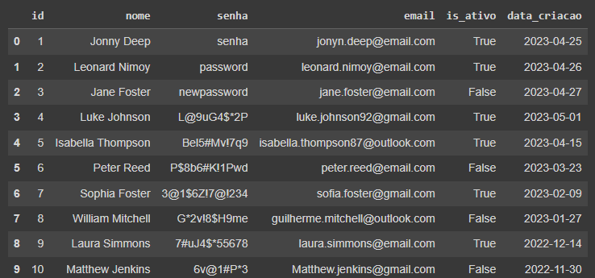
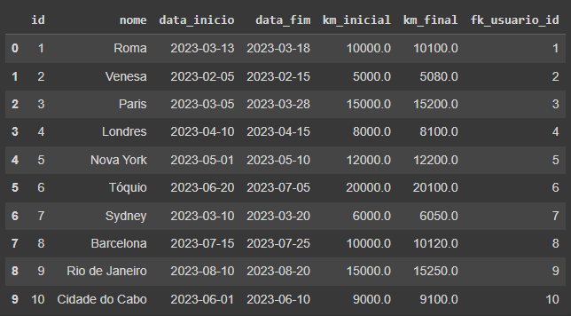
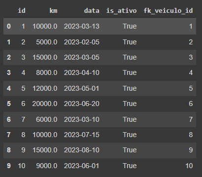
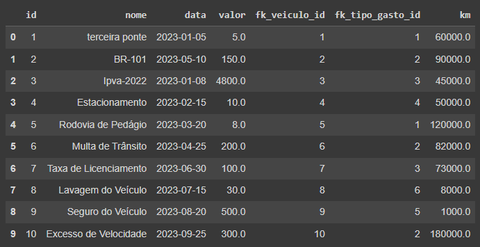
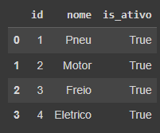
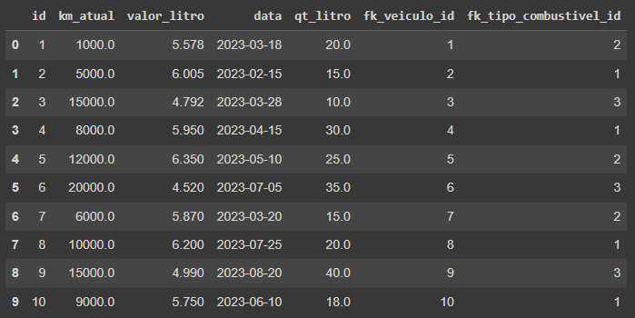

# TRABALHO 01: CarCents

Trabalho desenvolvido durante a disciplina de BD1

# Sumário

### 1. COMPONENTES 

Integrantes do grupo 
Kailany Faustino: kailanyfaustino@gmail.com 
Lucas Codeco: lucas.codeco2@gmail.com 
Micaely Gusmão: gusmaomicaely@gmail.com 
Richard Lucas: richardl1010@outlook.com 

### 2.INTRODUÇÃO E MOTIVAÇÃO 

Este documento contém a especificação do projeto do banco de dados <nome do projeto>
 e motivação da escolha realizada.  

> A empresa Abacaxi Tech sabendo da dificuldade existente entre os donos dos veículos para administrar os gastos e manutenções dos seus veículos iniciou a criação do projeto CarCents, um aplicativo para dispositivos móveis que tem como objetivo esclarecer para os usuários quanto cada veículo está gerando de despesas em um intervalo de tempo, lembretes que auxiliem em manutenções periódicas como troca de óleo e além disso existirá o controle em relação a gastos gerados para percursos como viagens. Para realizar essa ajuda na administração dos gastos é necessário armazenar dos usuários os seus veículos, gastos, manutenções, o registro de abastecimento para que possa ser possível calcular o consumo médio de cada veículo em relação ao tipo de combustível e informações sobre as viagens que serão/foram feitas. Nas telas de listagem dos gastos e manutenções deverá existir um filtro que permita o usuário colocar um intervalo de data e uma soma dos valores gastos nesse intervalo de datas possam aparecer.

### 3.MINI-MUNDO 

> O sistema do CarCents conterá as informações aqui detalhadas. Do usuário serão armazenados id, nome, senha, email, data_criacao e uma flag para ativo ou não. Dos veículos serão armazenados id, nome, placa, ano, id do tipo de veículo, a quilometragem em que foi feito a última troca de óleo e uma flag para ativo ou não. O mesmo veículo não poderá ser cadastrado mais de uma vez e cada veículo deverá ter um tipo de veículo vinculado a ele. Do tipo de veículo deverá ser armazenado o id, categoria e uma flag para ativo ou não. Do manutenção deverá ser armazenado o id, o id do tipo de manutenção, o id de qual veículo foi feita a manutenção, data, nome, valor gasto e a quilometragem atual do veículo em que essa manutenção foi feita. Do tipo de manutenção deverá ser armazenado o id, nome para que possa ser identificado e uma flag para ativo ou não. Dos gastos deverá ser armazenado o id, id do tipo de gasto, nome, valor gasto, data e id do veículo a que se refere o gasto registrado. Do tipo de gasto deverá ser registrado o id, nome para que esse tipo de gasto possa ser identificado no momento da vinculação com o gasto e uma flag para ativo ou não. Para as viagens deverá ser armazenado o id, data de início, data de fim onde essa não poderá ser menor que a data de início, km inicial, km final e somente depois de todos os campos preenchidos deverá ser possível mostrar o relatório de gastos com o trajeto cadastrado, exibindo o valor gasto com o combustível e km total percorrido. Para o armazenamento do consumo médio é necessário o registro do tipo de combustível que deverá ter o nome, id e uma flag para ativo ou não armazenados, para o consumo médio deverá ter o id do veículo ao qual se refere o consumo médio, quilômetro inicial, quilômetro final, data, quantidade de litros e valor do abastecimento. Para o controle de troca de óleo deverá ser registrado em uma tabela de quantos em quantos quilômetros deve ser a troca de óleo do veículo considerando o tipo de óleo que o usuário comprou para colocar, para isso deve ser registrado o id, o km para troca e um boolean para saber se o registro está ativo ou inativo.

### 4.PROTOTIPAÇÃO, PERGUNTAS A SEREM RESPONDIDAS E TABELA DE DADOS 

#### 4.1 RASCUNHOS BÁSICOS DA INTERFACE (MOCKUPS) 

Link para todas as telas: [https://whimsical.com/CarCents](https://whimsical.com/carcents-JghTqFLsGwd8PvrBB9aM8F@7YNFXnKbZA8iQdvdXYPvu "Whimsical")

[Arquivo PDF do Protótipo Whimiscal feito para o App CarCents](https://whimsical.com/carcents-JghTqFLsGwd8PvrBB9aM8F@7YNFXnKbZA8iQdvdXYPvu "Empresa ABACAXI TECH - CarCents")

#### 4.2 QUAIS PERGUNTAS PODEM SER RESPONDIDAS COM O SISTEMA PROPOSTO?

    a) Qual a maior fonte de gasto do meu veiculo?
    b) Qual foi o gasto total das minhas viagens?
    c) Quando vou precisar fazer manutenção?
    d) Quanto foi gasto em combustível?
    e) Quando vou precisar fazer uma troca de óleo?

> O APP CarCents precisa inicialmente dos seguintes relatórios:

- Relatório que mostre o gasto de cada veiculo, total e por categoria.
- Relátório que mostre o gasto de combústivel de um veiculo durante o tempo, deve ser possivél ver os gastos filtrados por um tipo de combustivel ou os gastos totais.
- Relátório de viagens, contendo gastos totais, quantidade de abastecimentos, munutenções feitas no processo.

#### 4.3 TABELA DE DADOS DO SISTEMA:

[Tabela de tudo relacionado ao sistema](https://docs.google.com/spreadsheets/d/1sU4ysGyTBmbPAMhycbn1cy_RSAn8-xCmRkbVHetMuF0/edit?usp=sharing "Tabela - CarCents")

### 5.MODELO CONCEITUAL 

Modelo conceitual resumido com as quatro principais tabelas do banco.

#### 5.1 Validação do Modelo Conceitual

    [Grupo01]: [Eduardo, Lucas Vieira, Matheus Colares, Victor]
    [Grupo02]: [Isabella Sampaio, Isabella Bissoli, Marcela, Renzo]

#### 5.2 Descrição dos dados

    USUARIO: Tabela que armazena os usuário donos de veículos que utilizam o sistema
        ID: campo que armazena o identificador unico de cada usuário
        NOME: campo que armazena o nome do usuário cadastrado
        SENHA: campo que armazena a senha do usuário para acessar o sistema
        EMAIL: campo que armazena o email do usuário usado para acessar o sistema
        IS_ATIVO: campo que armazena o status do usuário no sistema
        DATA_CRIAÇÃO: campo que armazena a data de criação da conta do usuário no sistema

    VEICULO: Tabela que armazena os veículos de um usuário no sistema
        ID: campo que armazena o identificador único de cada veiculo cadastrado no sistema
        NOME: campo que armazena o nome do veículo para identificação do usuário
        PLACA: campo que armazena a placa do veículo
        ANO: campo que armazena o ano do veículo
        KM_ULTIMA_TROCA: campo que armazena a quilometragem da última troca de óleo
        IS_ATIVO: campo que armazena o status do veículo no sistema, ativo ou inativo.

    CONSUMO_MEDIO: Tabela que armazena o consumo médio de um veiculo em relação ao tipo de combustivel utilizado para abastecimento
        ID: campo que armazena o identificador unico do consumo médio
        KM_INICAL: campo que armazena a quilometragem inicial do veículo no momento do abastecimento
        KM_FINAL: campo que armazena a quilometragem final do veículo no momento do proximo abastecimento
        DATA: campo que armazena a data que o abastecimento foi feito
        QTD_LITROS: campo que armazena a quantidade de litros abastecidos
        VALOR_ABASTECIMENTO: campo que armazena o valor do gasto com o abastecimento

    TIPO_COMBUSTIVEL: Tabela que armazena os tipos de combustiveis que podem ser relacionados no momento do abastecimento do veiculo
        ID: campo que armazena o identificador unico do tipo de combustível
        NOME: campo que armazena o identificador unico do nome do combustivel
        IS_ATIVO: campo que armazena o status do tipo de combustivel dentro do sistema, ativo ou inativo.

### 6 MODELO LÓGICO 

Modelo lógico resumido com as quatro principais tabelas do banco.

### 7 MODELO FÍSICO 

        CREATE DATABASE carcentsdb
        WITH
        OWNER = postgres
        ENCODING = 'UTF8'
        LC_COLLATE = 'Portuguese_Brazil.1252'
        LC_CTYPE = 'Portuguese_Brazil.1252'
        TABLESPACE = pg_default
        CONNECTION LIMIT = -1
        IS_TEMPLATE = False;

    CREATE TABLE USUARIO (
        id integer PRIMARY KEY,
        nome varchar(80),
        senha varchar(16),
        email varchar(80),
        is_ativo boolean,
        data_criacao date
    );

    CREATE TABLE VIAGEM (
        id integer PRIMARY KEY,
        nome varchar(80),
        data_inicio date,
        data_fim date,
        km_inicial float,
        km_final float,
        fk_USUARIO_id integer,
        FOREIGN KEY(fk_USUARIO_id) 
	  	REFERENCES usuario(id)
    );

    CREATE TABLE TIPO_VEICULO (
        id integer PRIMARY KEY,
        categoria varchar(80),
        is_ativo boolean
    );

    CREATE TABLE VEICULO (
        id integer PRIMARY KEY,
        nome varchar(80),
        placa varchar(20),
        ano integer,
        km_ultima_troca float,
        is_ativo boolean,
        fk_USUARIO_id integer,
        FOREIGN KEY(fk_USUARIO_id) 
	  	REFERENCES usuario(id),
        fk_TIPO_VEICULO_id integer,
	  	FOREIGN KEY(fk_TIPO_VEICULO_id) 
	  	REFERENCES tipo_veiculo(id)
    );

    CREATE TABLE TROCA_OLEO (
        id integer PRIMARY KEY,
        km float,
        data date,
        is_ativo boolean,
        fk_VEICULO_id integer,
        FOREIGN KEY(fk_VEICULO_id) 
	  	REFERENCES veiculo(id)
    );

    CREATE TABLE TIPO_COMBUSTIVEL (
        id integer PRIMARY KEY,
        nome varchar(80),
        is_ativo boolean
    );

    CREATE TABLE CONSUMO_MEDIO (
        id integer PRIMARY KEY,
        km_atual float,
        valor_litro float,
        data date,
        qt_litro float,
        fk_VEICULO_id integer,
        FOREIGN KEY(fk_VEICULO_id) 
	  	REFERENCES veiculo(id),
        fk_TIPO_COMBUSTIVEL_id integer,
        FOREIGN KEY(fk_TIPO_COMBUSTIVEL_id) 
	  	REFERENCES tipo_combustivel(id)        
    );

    CREATE TABLE TIPO_MANUTENCAO (
        id integer PRIMARY KEY,
        nome varchar(80),
        is_ativo boolean
    );

    CREATE TABLE MANUTENCAO (
        id integer PRIMARY KEY,
        nome varchar(80),
        valor float,
        data date,
        km float,
        fk_VEICULO_id integer,
        FOREIGN KEY(fk_VEICULO_id) 
	  	REFERENCES veiculo(id),
        fk_TIPO_MANUTENCAO_id integer,
        FOREIGN KEY(fk_TIPO_MANUTENCAO_id) 
	  	REFERENCES tipo_manutencao(id)
    );

    CREATE TABLE TIPO_GASTO (
        id integer PRIMARY KEY,
        nome varchar(80),
        is_ativo boolean
    );

    CREATE TABLE GASTO (
        id integer PRIMARY KEY,
        nome varchar(80),
        data date,
        valor integer,
        fk_VEICULO_id integer,
        FOREIGN KEY(fk_VEICULO_id) 
	  	REFERENCES veiculo(id),
        fk_TIPO_GASTO_id integer,
        FOREIGN KEY(fk_TIPO_GASTO_id) 
	  	REFERENCES tipo_gasto(id),
        km integer
    );

### 8 INSERT APLICADO NAS TABELAS DO BANCO DE DADOS 

    INSERT INTO USUARIO (id, nome, senha, email, is_ativo, data_criacao)
    VALUES
        (1, 'Jonny Deep', 'senha', 'jonyn.deep@email.com', true, '2023-04-25'),
        (2, 'Leonard Nimoy', 'password', 'leonard.nimoy@email.com', true, '2023-04-26'),
        (3, 'Jane Foster', 'newpassword', 'jane.foster@email.com', false, '2023-04-27'),
        (4, 'Luke Johnson', 'L@9uG4$*2P', 'luke.johnson92@gmail.com', true, '2023-05-01'),
        (5, 'Isabella Thompson', 'Bel5#Mv!7q9', 'isabella.thompson87@outlook.com', true, '2023-04-15'),
        (6, 'Peter Reed', 'P$8b6#K!1Pwd', 'peter.reed@email.com', false, '2023-03-23'),
        (7, 'Sophia Foster', '3@1$6Z!7@!234', 'sofia.foster@gmail.com', true, '2023-02-09'),
        (8, 'William Mitchell', 'G*2v!8$H9me', 'guilherme.mitchell@outlook.com', false, '2023-01-27'),
        (9, 'Laura Simmons', '7#uJ4$*55678', 'laura.simmons@email.com', true, '2022-12-14'),
        (10, 'Matthew Jenkins', '6v@1#P*3', 'Matthew.jenkins@gmail.com', false, '2022-11-30');

    INSERT INTO VIAGEM (id,	nome, data_inicio, data_fim, km_inicial, km_final, fk_USUARIO_id)
    VALUES
        (1, 'Roma', '2023-03-13', '2023-03-18', 10000, 10100, 1),
        (2, 'Venesa',  '2023-02-05', '2023-02-15', 5000, 5080, 2),
        (3, 'Paris',  '2023-03-05', '2023-03-28', 15000, 15200, 3),
        (4, 'Londres', '2023-04-10', '2023-04-15', 8000, 8100, 4),
        (5, 'Nova York', '2023-05-01', '2023-05-10', 12000, 12200, 5),
        (6, 'Tóquio', '2023-06-20', '2023-07-05', 20000, 20100, 6),
        (7, 'Sydney', '2023-03-10', '2023-03-20', 6000, 6050, 7),
        (8, 'Barcelona', '2023-07-15', '2023-07-25', 10000, 10120, 8),
        (9, 'Rio de Janeiro', '2023-08-10', '2023-08-20', 15000, 15250, 9),
        (10, 'Cidade do Cabo', '2023-06-01', '2023-06-10', 9000, 9100, 10);

    INSERT INTO TIPO_VEICULO (id, categoria, is_ativo)
    VALUES
        (1, 'Carro', true),
        (2, 'Moto', true),
        (3, 'Caminhão', false);

    INSERT INTO VEICULO (id, nome, placa, ano, km_ultima_troca, is_ativo, fk_USUARIO_id, fk_TIPO_VEICULO_id)
    VALUES
        (1, 'Carro A', 'ABC-1234', 2015, 10000, true, 1, 1),
        (2, 'Moto B', 'DEF-5678', 2018, 5000, true, 2, 2),
        (3, 'Carro C', 'GHI-9012', 2020, 15000, false, 3, 1),
        (4, 'Carro D', 'JKL-3456', 2017, 8000, true, 4, 1),
        (5, 'Moto E', 'MNO-7890', 2019, 12000, true, 5, 2),
        (6, 'Caminhão F', 'PQR-2345', 2016, 20000, true, 6, 3),
        (7, 'Carro G', 'STU-6789', 2021, 6000, true, 7, 1),
        (8, 'Moto H', 'VWX-0123', 2018, 10000, true, 8, 2),
        (9, 'Carro I', 'YZA-4567', 2020, 15000, false, 9, 1),
        (10, 'Caminhão J', 'BCD-8901', 2015, 9000, true, 10, 3);

    INSERT INTO TROCA_OLEO (id, km, data, is_ativo, fk_VEICULO_id)
    VALUES
        (1, '10000', '2023-03-13', true, 1),
        (2, '5000', '2023-02-05', true, 2),
        (3, '15000', '2023-03-05', true, 3),
        (4, '8000', '2023-04-10', true, 4),
        (5, '12000', '2023-05-01', true, 5),
        (6, '20000', '2023-06-20', true, 6),
        (7, '6000', '2023-03-10', true, 7),
        (8, '10000', '2023-07-15', true, 8),
        (9, '15000', '2023-08-10', true, 9),
        (10, '9000', '2023-06-01', true, 10);

    INSERT INTO TIPO_COMBUSTIVEL (id, nome, is_ativo)
    VALUES
        (1, 'Gasolina', true),
        (2, 'Etanol', true),
        (3, 'Diesel', true);

    INSERT INTO CONSUMO_MEDIO (id, km_atual, valor_litro, data, qt_litro, fk_VEICULO_id, fk_TIPO_COMBUSTIVEL_id)
    VALUES
        (1, 1000, 5.578, '2023-03-18', 20, 1, 2),
        (2, 5000, 6.005, '2023-02-15', 15, 2, 1),
        (3, 15000, 4.792, '2023-03-28', 10, 3, 3),
        (4, 8000, 5.950, '2023-04-15', 30, 4, 1),
        (5, 12000, 6.350, '2023-05-10', 25, 5, 2),
        (6, 20000, 4.520, '2023-07-05', 35, 6, 3),
        (7, 6000, 5.870, '2023-03-20', 15, 7, 2),
        (8, 10000, 6.200, '2023-07-25', 20, 8, 1),
        (9, 15000, 4.990, '2023-08-20', 40, 9, 3),
        (10, 9000, 5.750, '2023-06-10', 18, 10, 1);

    INSERT INTO TIPO_MANUTENCAO (id, nome, is_ativo)
    VALUES
        (1, 'Pneu', true),
        (2, 'Motor', true),
        (3, 'Freio', true),
        (4, 'Eletrico', true);

    INSERT INTO MANUTENCAO (id, nome, valor , data , km, fk_VEICULO_id, fk_TIPO_MANUTENCAO_id)
    VALUES
        (1, 'Troca de pneus', 5000, '2022-01-05', 50000, 1, 1),
        (2, 'Reparo no motor', 2500, '2022-03-10', 80000, 3, 2),
        (3, 'Troca de freios', 1800, '2022-05-15', 75000, 2, 3),
        (4, 'Troca de pneus', 100, '2022-02-15', 55000, 4, 1),
        (5, 'Revisão completa', 3000, '2022-04-20', 90000, 5, 4),
        (6, 'Alinhamento e balanceamento', 500, '2022-06-25', 65000, 6, 3),
        (7, 'Troca de correia dentada', 800, '2022-08-30', 70000, 7, 1),
        (8, 'Limpeza de bicos injetores', 200, '2022-10-05', 60000, 8, 2),
        (9, 'Substituição de fluido', 50, '2022-12-10', 85000, 9, 3),
        (10, 'Reparo no sistema elétrico', 1500, '2022-11-15', 95000, 10, 4);

    INSERT INTO TIPO_GASTO (id, nome, is_ativo)
    VALUES
        (1, 'Pedagio', true),
        (2, 'Multa', true),
        (3, 'IPVA', true),
        (4, 'Estacionamento', true),
        (5, 'Seguro', true),
        (6, 'Lava a jato', true);

    INSERT INTO GASTO (id, nome, data, valor, fk_VEICULO_id, fk_TIPO_GASTO_id, km)
    VALUES
        (1, 'terceira ponte', '2023-01-05', 5, 1, 1, 60000.0),
        (2, 'BR-101', '2023-05-10',150, 2, 2, 90000.0),
        (3, 'Ipva-2022', '2023-01-08', 4800, 3, 3, 45000.0),
        (4, 'Estacionamento', '2023-02-15', 10, 4, 4, 50000.0),
        (5, 'Rodovia de Pedágio', '2023-03-20', 8, 5, 1, 120000.0),
        (6, 'Multa de Trânsito', '2023-04-25', 200, 6, 2, 82000.0),
        (7, 'Taxa de Licenciamento', '2023-06-30', 100, 7, 3, 73000.0),
        (8, 'Lavagem do Veículo', '2023-07-15', 30, 8, 6, 8000.0),
        (9, 'Seguro do Veículo', '2023-08-20', 500, 9, 5, 1000.0),
        (10, 'Excesso de Velocidade', '2023-09-25', 300, 10, 2, 180000.0);

Link para backup do Banco de dados 
[Backup_CarCents](arquivos/Backup_CarCents.sql "Backup_CarCents")
    
    
### 9 TABELAS E PRINCIPAIS CONSULTAS 

    OBS: Incluir para cada tópico as instruções SQL + imagens (print da tela) mostrando os resultados. 

#### 9.1 CONSULTAS DAS TABELAS COM TODOS OS DADOS INSERIDOS (Todas)  

    SELECT * FROM usuario;

    SELECT * FROM viagem;

    SELECT * FROM veiculo;

    SELECT * FROM tipo_veiculo;

    SELECT * FROM troca_oleo;

    SELECT * FROM gasto;

    SELECT * FROM tipo_gasto;

    SELECT * FROM manutencao;

    SELECT * FROM tipo_manutencao;

    SELECT * FROM consumo_medio;

    SELECT * FROM tipo_combustivel;

> # Marco de Entrega 01: Do item 1 até o item 9.1 

#### 9.2 CONSULTAS DAS TABELAS COM FILTROS WHERE (Mínimo 4) 

#### 9.3 CONSULTAS QUE USAM OPERADORES LÓGICOS, ARITMÉTICOS E TABELAS OU CAMPOS RENOMEADOS (Mínimo 11)

    a) Criar 5 consultas que envolvam os operadores lógicos AND, OR e Not
    b) Criar no mínimo 3 consultas com operadores aritméticos
    c) Criar no mínimo 3 consultas com operação de renomear nomes de campos ou tabelas

#### 9.4 CONSULTAS QUE USAM OPERADORES LIKE E DATAS (Mínimo 12)  

    a) Criar outras 5 consultas que envolvam like ou ilike
    b) Criar uma consulta para cada tipo de função data apresentada.

#### 9.5 INSTRUÇÕES APLICANDO ATUALIZAÇÃO E EXCLUSÃO DE DADOS (Mínimo 6) 

    a) Criar minimo 3 de exclusão
    b) Criar minimo 3 de atualização

#### 9.6 CONSULTAS COM INNER JOIN E ORDER BY (Mínimo 6) 

    a) Uma junção que envolva todas as tabelas possuindo no mínimo 2 registros no resultado
    b) Outras junções que o grupo considere como sendo as de principal importância para o trabalho

#### 9.7 CONSULTAS COM GROUP BY E FUNÇÕES DE AGRUPAMENTO (Mínimo 6) 

    a) Criar minimo 2 envolvendo algum tipo de junção

#### 9.8 CONSULTAS COM LEFT, RIGHT E FULL JOIN (Mínimo 4) 

    a) Criar minimo 1 de cada tipo

#### 9.9 CONSULTAS COM SELF JOIN E VIEW (Mínimo 6) 

        a) Uma junção que envolva Self Join (caso não ocorra na base justificar e substituir por uma view)
        b) Outras junções com views que o grupo considere como sendo de relevante importância para o trabalho

#### 9.10 SUBCONSULTAS (Mínimo 4) 

     a) Criar minimo 1 envolvendo GROUP BY
     b) Criar minimo 1 envolvendo algum tipo de junção

> # Marco de Entrega 02: Do item 9.2 até o ítem 9.10 

### 10 RELATÓRIOS E GRÁFICOS

#### a) análises e resultados provenientes do banco de dados desenvolvido (usar modelo disponível)

#### b) link com exemplo de relatórios será disponiblizado pelo professor no AVA

#### OBS: Esta é uma atividade de grande relevância no contexto do trabalho. Mantenha o foco nos 5 principais relatórios/resultados visando obter o melhor resultado possível.

### 11 AJUSTES DA DOCUMENTAÇÃO, CRIAÇÃO DOS SLIDES E VÍDEO PARA APRESENTAÇAO FINAL  

#### a) Modelo (pecha kucha) 

#### b) Tempo de apresentação 6:40

> # Marco de Entrega 03: Itens 10 e 11 
>
>  
>  

### 12 FORMATACAO NO GIT: 

https://help.github.com/articles/basic-writing-and-formatting-syntax/
<comentario no git>

##### About Formatting

    https://help.github.com/articles/about-writing-and-formatting-on-github/

##### Basic Formatting in Git

    https://help.github.com/articles/basic-writing-and-formatting-syntax/#referencing-issues-and-pull-requests

##### Working with advanced formatting

    https://help.github.com/articles/working-with-advanced-formatting/

#### Mastering Markdown

    https://guides.github.com/features/mastering-markdown/

### OBSERVAÇÕES IMPORTANTES

#### Todos os arquivos que fazem parte do projeto (Imagens, pdfs, arquivos fonte, etc..), devem estar presentes no GIT. Os arquivos do projeto vigente não devem ser armazenados em quaisquer outras plataformas.

1. <strong>Caso existam arquivos com conteúdos sigilosos<strong>, comunicar o professor que definirá em conjunto com o grupo a melhor forma de armazenamento do arquivo.

#### Todos os grupos deverão fazer Fork deste repositório e dar permissões administrativas ao usuário do git "profmoisesomena", para acompanhamento do trabalho.

#### Os usuários criados no GIT devem possuir o nome de identificação do aluno (não serão aceitos nomes como Eu123, meuprojeto, pro456, etc). Em caso de dúvida comunicar o professor.

### Links

Link para BrModelo: 
http://www.sis4.com/brModelo/download.html
 
    
Link para curso de GIT 
[https://www.youtube.com/curso_git](https://www.youtube.com/playlist?list=PLo7sFyCeiGUdIyEmHdfbuD2eR4XPDqnN2?raw=true "Curso Git")

Link para Colab: 
[https://colab.research.google.com/CarCents](https://colab.research.google.com/drive/1dPm90wXv7GtHWrr5LA-NGk72fqkIXXG4 "Colab")
